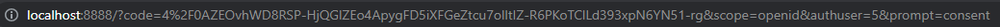
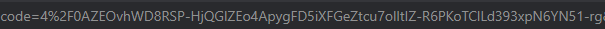

# FRC - Projeto Pesquisa

Projeto de Pesquisa da matéria de Fundamentos de Redes de Computadores

## Branch Main

Nesta branch temos o chatroom rodadando com todas as funcionalidades definidas pelo roteiro do projeto, porém sem autenticação OAuth2.0.

### Como rodar

#### Iniciando o servidor

```
$ gcc -o main main.c

$ ./main
```

#### Iniciando o cliente

```
$ telnet localhost 8888

```

## Branch OAuth2.0

Nesta branch temos o protocolo OAuth2.0 parcialmente implementado, porém não está completamente funcional.

### Como rodar

Utilize os mesmos comandos usados para rodar a main, depois iniciar o cliente, siga os seguintes passos:

- Digite seu nome de usuário
- Prossiga para a URL fornecida
- Faça sua autenticação com a seguinte conta google => Conta: projetochatredesunb@gmail.com Senha: redesunb
- Após entrar com a conta google copie o conteúdo do header "code= " presente na URL que foi direcionado
  
  
- Cole o code no terminal da aplicação e digite enter
- Você foi autenticado!
